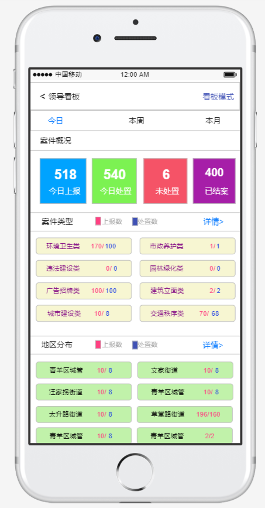
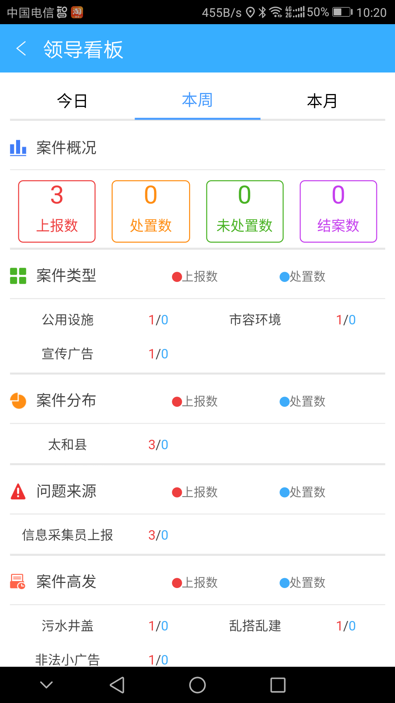
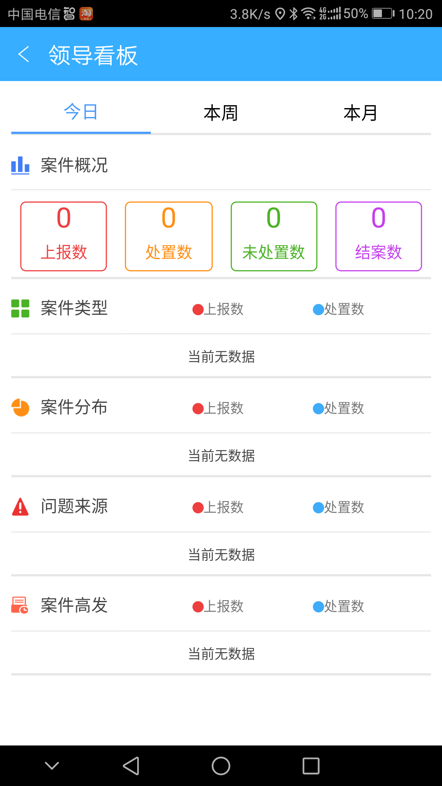
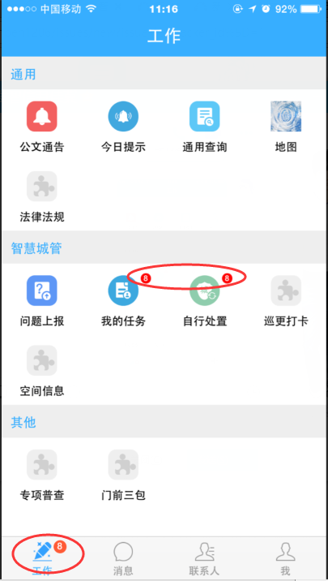
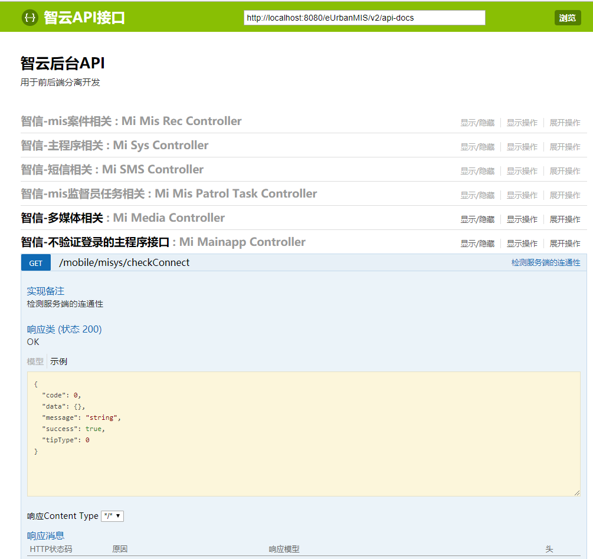

# 智信后台组年中汇报-2018
## 参与完成的功能
1. 领导看板<br>
    <br>
    <br>
    <br>
1. 出格报备
1. 插件角标<br>
    <br>
1. mobile依赖swagger<br>
    <br>


## 遇到的坑
1. session中获取不到humanID的问题
    ```
    HumanSession humanSession = SessionUtils.getHumanSession(request);
    if(humanSession == null){
        request.getSession().setAttribute(SessionUtils.HUMAN_SESSION, human);
        SessionUtils.setHumanSession(human);
    }else{
        ……
    }
    ```
1. 宁波部分用户查看不到图片的问题
1. 平顶山二次核查不通过异常[【#15664】](http://faq.egova.com.cn:7777/redmine/issues/15664)
    <br>

1.  [数据源切换问题](http://note.youdao.com/noteshare?id=0720311971dc720fc615d70abb254ca8)


## 槽点
1. 移植
 * 案件查询
 * 领导看板
 * 出格报备
 * 综合督查
 * 多媒体
2. 兼容
 *
3. 冗余功能、未完成功能
 * 信息专报
4. 无需求审核，接口随时改，代码“回溯”
 * 赣州即时通讯消息，加了又删
 * 监督员任务列表，改了又改回来
5. 你永远不知道他调的哪个接口，传了哪些参数！！
6. “请后台同事排查”

## 革命尚未完成
1. 登录问题
1. 多媒体问题
1. 上报问题
2. 重构
