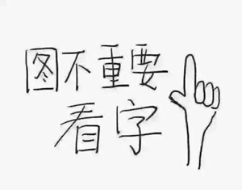
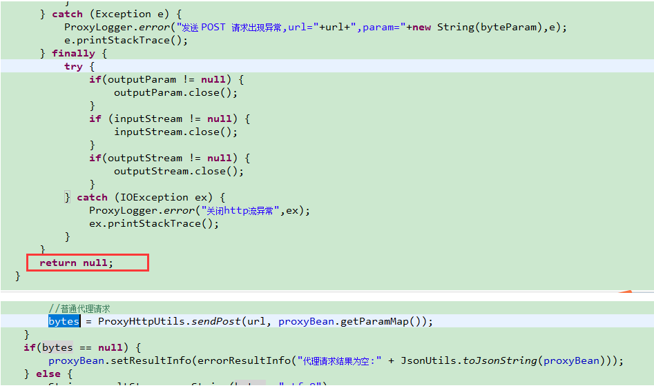
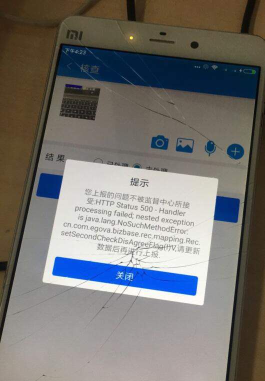
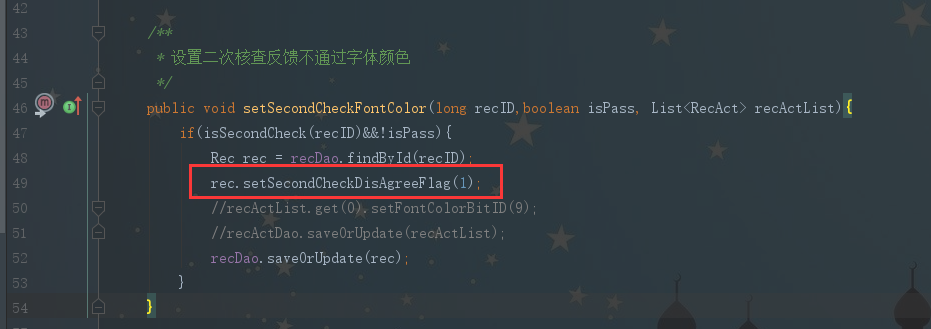
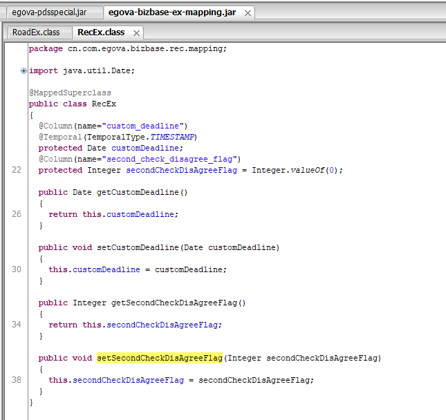
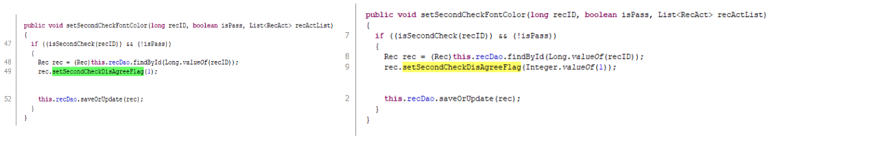

# 智信后台组年中汇报-2018
## 参与完成的功能
1. 领导看板<br>
       <br>
1. 出格报备<br>
    <br>
1. 插件角标<br>
    <br>
1. mobile依赖swagger<br>
    <br>
## 遇到的坑
1. session中获取不到humanID的问题
    ```
    HumanSession humanSession = SessionUtils.getHumanSession(request);
    if(humanSession == null){
        request.getSession().setAttribute(SessionUtils.HUMAN_SESSION, human);
        SessionUtils.setHumanSession(human);
    }else{
        ……
    }
    ```
2. 宁波部分用户查看不到图片的问题[【#9294】](http://faq.egova.com.cn:7777/redmine/issues/9294)
    * proxy存在的问题：如果出现401或者500，将直接返回null,此后直接推送空结果到外网proxyserver。这就导致登录验证失败时不会提示客户端重新登录，且客户端一直拿不到请求结果。
    <br>
    * 与203:8987交互的网络设备（防火墙之类），存在故障，导致tcp包丢失和错误，需现场和业主进行沟通，联系中间设备提供商排查故障。
3. 平顶山二次核查不通过异常[【#15664】](http://faq.egova.com.cn:7777/redmine/issues/15664)<br>
    * <br>
    * 二次核查不通过反馈时，报错  org.springframework.web.util.NestedServletException: Handler processing failed; nested exception is java.lang.NoSuchMethodError: `cn.com.egova.bizbase.rec.mapping.Rec.setSecondCheckDisAgreeFlag(I)V`
        at org.springframework.web.servlet.DispatcherServlet.triggerAfterCompletionWithError(DispatcherServlet.java:1287)
            ……
     Caused by: java.lang.NoSuchMethodError: `cn.com.egova.bizbase.rec.mapping.Rec.setSecondCheckDisAgreeFlag(I)V`
        at cn.com.egova.pdsspecial.service.impl.PDSSpecialManagerImpl.setSecondCheckFontColor(PDSSpecialManagerImpl.java:49)
        at cn.com.egova.pdsspecial.service.impl.PDSSpecialManagerImpl$$FastClassBySpringCGLIB$$97f64cec.invoke(<generated>)
        at org.springframework.cglib.proxy.MethodProxy.invoke(MethodProxy.java:204)
        at org.springframework.aop.framework.CglibAopProxy$CglibMethodInvo
    * 调用代码
    
    * 类定义
    
    * 反编译对比
    
    * 总结：虽然`pdsspecial`未提交代码，但是调用方法参数类型发生了变化，`int==>Integer`，虽然调用代码时，写法没有区别，编译器会自动帮我们转换，但是如果调用方法的代码不重新编译打包，就会出现错误： `java.lang.NoSuchMethodError`。
    所以，即使没有修改`pdsspecial`的代码，但仍需要重新编译打包`pdsspecial`。
    * 至此，问题虽然解决，但是也暴露出根据提交的代码涉及的插件包而只更新一部分jar存在的隐患。
4.  [数据源切换问题](http://note.youdao.com/noteshare?id=0720311971dc720fc615d70abb254ca8)
    * 当在service层调用dao层进行数据库处理时，若service 没有启动事务机制，则执行的顺序为：切面——>determineCurrentLookupKey——>Dao方法。而当在service层启动事务时，由于在一个事务中执行失败后会回滚之前所执行的所有操作，因此spring会在service方法执行前调用`determineCurrentLookupKey`，此时无论`service`中有多少个dao调用，`determineCurrentLookupKey`将不再执行，即在事务中不支持数据源切换。
    * 总结：公司的代码框架给 `execution(* cn.com.egova..service.*Manager.*(..))` 方法添加了事务，事务内不支持切换数据源。因此*Manager方法中调用使用两个不同数据源的其他`*Manager`方法时，无法正确切换数据源。为了保证切换使用业务库和统计库，外层接口名称不要使用`*Manager`结尾，建议写成`*Mgr`，参考`plugin\mobile\cn\com\egova\mobile\job\service\MiInitUpdateDataMgr.java`。修改后`*Mgr`的方法将不支持事务，数据库的操作建议在其他*Manager中进行，然后在*Mgr的方法中调用。

## 槽点
1. 移植
    * 案件查询 、领导看板 、 出格报备、 综合督查、 多媒体<br>
    <br>
2. 兼容
    * 井冈山IOS
3. 冗余功能、未完成功能
    * 信息专报
4. 无需求审核，接口随时改，代码“回溯”
    * 赣州即时通讯消息，加了又删
    * 监督员任务列表，改了又改回来
5. 你永远不知道他调的哪个接口，传了哪些参数！！
6. “请后台同事排查”

## 革命尚未完成
1. 登录问题
1. 多媒体问题
1. 上报问题
2. 重构
